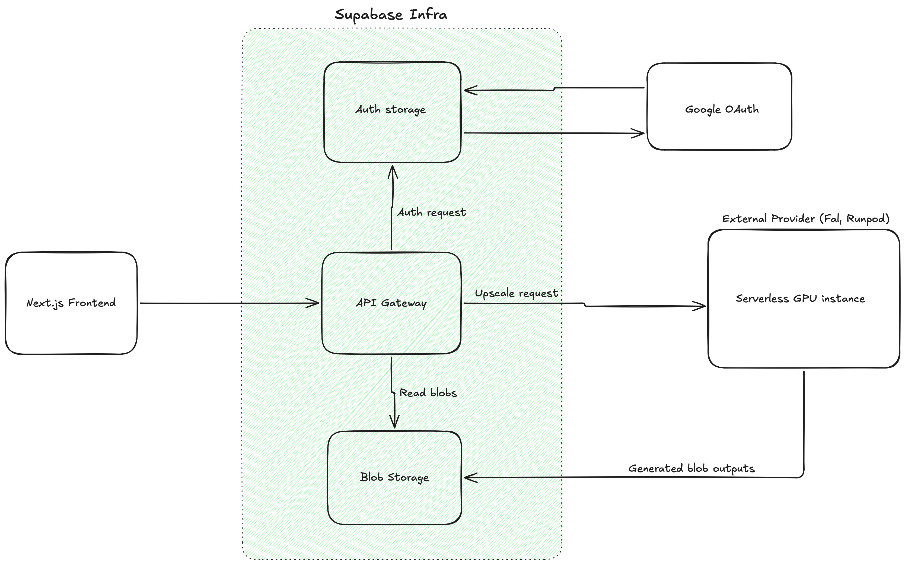

# System Architecture

This document describes the system architecture of this project. A visual diagram made with Excalidraw is attached below.

The incoming request is handled by Supabase API gateway and is routed to different Supabase services depending on the incoming request.

For the authentication part, the site stores the authenticated user information in Supabase Auth table. All of the users are Authorized by Google OAuth 2.0.

The authenticated account area currently lives under `/settings`. It uses a shared left-rail settings shell with separate right-pane views for `App` and `Credits`.

Credits are persisted in Supabase Postgres. The implementation uses a per-user balance table (`user_credit_balances`), an activity ledger (`credit_activity`), and a mutation RPC (`apply_manual_credit_topup`) so the header balance and the credits settings view read from the same server-side source of truth.

For upscaling images and videos with AI, an external neocloud infrastructure is used. This could either be Fal AI, Runpod or any other service. A new serverless instance is started to process the incoming request. 
The media is upscaled and is stored to Supabase object storage. Each blob stored has a specific URL associated with it which is stored in the Supabase Postgres database and is returned to the user.
