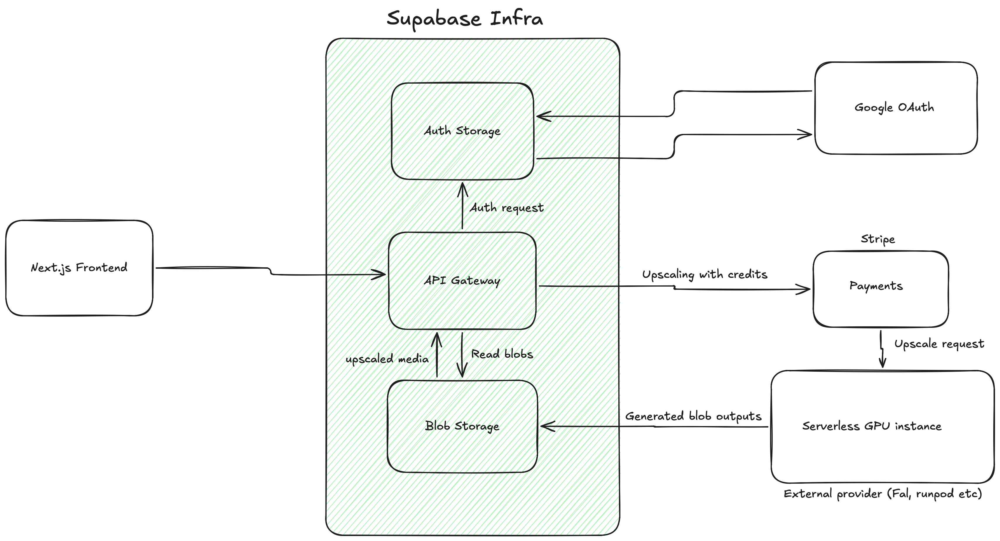

# System Architecture

This document describes the system architecture of this project. A visual diagram made with Excalidraw is attached below.

The incoming request is handled by Supabase API gateway and is routed to different Supabase services depending on the incoming request.

For the authentication part, the site stores the authenticated user information in Supabase Auth table. All of the users are Authorized by Google OAuth 2.0.

The authenticated account area currently lives under `/settings`. It uses a shared left-rail settings shell with separate right-pane views for `App` and `Credits`.

Credits are persisted in Supabase Postgres. The implementation uses a per-user balance table (`user_credit_balances`), an activity ledger (`credit_activity`), and two mutation RPCs:

- `apply_manual_credit_topup(p_amount)` — security invoker, called from a server action with the user's session. Used as a dev backdoor and for legacy/manual top-ups.
- `apply_stripe_credit_topup(p_user_id, p_amount, p_session_id)` — security definer, called from the Stripe webhook with the service-role key. Idempotent on `stripe_session_id` so replayed webhook events do not double-credit.

The header balance and the credits settings view read from the same row, so both reflect Stripe-driven and manual changes immediately after the next render.

Paid credit top-ups go through **Stripe Embedded Checkout**. The flow:

1. `/settings/credits` triggers the server action `createCheckoutSessionAction(amount)`, which creates a Stripe Checkout Session (`ui_mode: 'embedded_page'`, `mode: 'payment'`) carrying `metadata.user_id` and `metadata.amount_credits`.
2. The client renders Stripe's `<EmbeddedCheckoutProvider>` inline using the returned `client_secret`. Stripe owns the form UI; we own the trigger and the credit grant.
3. After payment, Stripe POSTs `checkout.session.completed` to the **Supabase Edge Function** `stripe-webhook` (`<supabase>/functions/v1/stripe-webhook`). The function (Deno) verifies the signature, extracts metadata, and calls `apply_stripe_credit_topup` via a service-role Supabase client built from auto-injected `SUPABASE_URL` / `SUPABASE_SERVICE_ROLE_KEY`. It runs next to the DB — no Vercel hop, no split env. (Originally a Next.js route; deleted.)
4. The dashboard runs `router.refresh()` ~1.5s after `onComplete` so the user sees the updated balance and a new "Card top-up" row.

See `docs/integrations/STRIPE.md` for the file inventory, env vars, idempotency model, and the local-dev workflow (Stripe CLI + local Supabase migrations).

For upscaling images and videos with AI, an external neocloud infrastructure is used. This could either be Fal AI, Runpod or any other service. A new serverless instance is started to process the incoming request. The media is upscaled and is stored to Supabase object storage. Each blob stored has a specific URL associated with it which is stored in the Supabase Postgres database and is returned to the user. The GPU service is not yet wired up — it will eventually consume the credit balance maintained by the Stripe + Supabase flow above.
